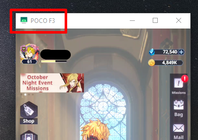

# Tog-New-World
A script I wrote for the game *'Tower of God: New World'* to automate some boring functions.

## What can it do?
Can automatically scale the tower in adventure, complete the trial of chaos.

## How to use
- Download [Scrcpy](https://github.com/Genymobile/scrcpy) to connect and allow your phone to be controlled by your computer. Any other program that have that functionality (or similar) will work too, like Bluestack.
  - Good and fast tutorial for installing and using Scrcpy: [link](https://www.youtube.com/watch?v=2y35SPOaNWk&t=193s)
- Start the main file with `start.bat`
    - First, you will need to select the option you want to do (1 - Auto Adventure, 2 - Trial of Chaos, etc...)
    - Second, will be asked to enter the name of the window broadcasting your phone, not the name of the program, the window's.
        - For example: in this case I would input "POCO F3"
        - 
    - Follow the instruction on the cmd. 
        - Example: for scaling the tower in Adventure, you will need to go into Adventure from the main lobby of the game and then press Enter on the cmd to continue.

## Info
If you your phone is laggy or some other problems appear like being out of sync or getting stuck in another section, it will be able to fix itself, don't touch it.
Otherwise you can simply start it again.
  
