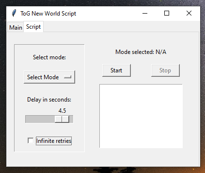

# Tog-New-World
A script I wrote for the game *'Tower of God: New World'* to automate some boring functions.

## What can it do?
Can automatically scale the tower in adventure, do the Trial of Chaos and Guardian Test.

## Install
- Download [Scrcpy](https://github.com/Genymobile/scrcpy) to connect and allow your phone to be controlled by your computer. Any other program that have that functionality (or similar) will work too, like Bluestack.
  - Good and fast tutorial for installing and using Scrcpy: [link](https://www.youtube.com/watch?v=2y35SPOaNWk&t=193s)

- Now to install the script, either you have python or you don't.

### I have Python
- Install the requirements in the requirements.txt file: `pip install -r requirements.txt`
- Start the main file with `ToG Start.bat`

### I don't have Python
- Download the zip file named `ToG New World.zip` from this link: [zip file](https://drive.google.com/file/d/1JuqNsu5R-qfHCaV_Op3EgdiDPxidGMM2/view), extract it and inside you will find an .exe called 'ToG Start.exe', use that to start the script.
    - The folder is pretty heavy since it needs to include a copy of the Python interpreter and the necessary libraries.
    - Standalone was created using Nuitka

## How to use
Start the script, either through the 'start.bat' or the 'ToG Start.exe' depending if you have python.
- First, it will ask enter the name of the window broadcasting your phone and/or game, not the name of the program, the window's.
    - For example: in this case I would input "POCO F3"
    - 

- Another tab will open called Script, select the mode you want and Start.
    - You need to enter the mode in the game too for the script to start.
        - Example: for scaling the tower in Adventure, you will need to go into Adventure from the main lobby of the game.
        - You can make the script faster by lowering the delay, default is 4.5s
        - Infinite retries will make the script try the battle again if you lose.
    - 

## Info
If you your phone is laggy or some other problems appear like being out of sync or getting stuck in another section, it will be able to fix itself, don't touch it.
Otherwise you can simply start it again.
  
